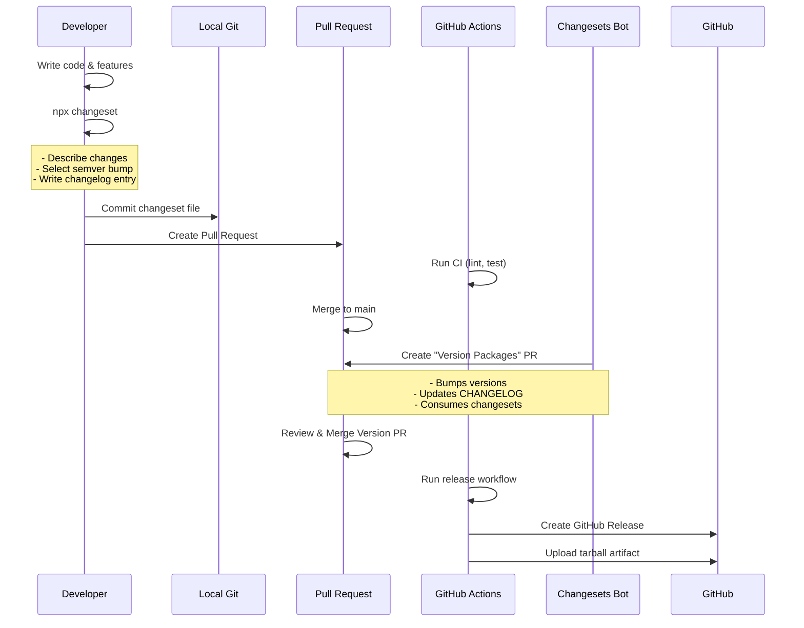

# node-release-poc (Changesets Branch)

**Branch**: `changesets` - Demonstrates explicit change declaration using Changesets

Proof-of-concept showing the **Changesets approach** with:
- Explicit changeset files for every change
- Maximum control over releases and changelogs
- Collaborative changelog creation
- PR-based version packages workflow

## Quick Start

1. Install dependencies:

```bash
npm ci
```

2. Install Git hooks:

```bash
npm run prepare
```

3. Run tests:

```bash
npm test
```

4. Lint code:

```bash
npm run lint
```

5. Build package tarball:

```bash
npm run build
# Creates tarball in ./dist/
```

## Changesets Release Process



### Step 1: Make code changes

```bash
git checkout -b feature/new-feature
# Make your changes...
git commit -m "feat: add new user endpoint"
```

### Step 2: Create a changeset

```bash
npx changeset
# Interactive prompts:
# 1. Select packages to include (select this package)
# 2. Select semver bump type (patch/minor/major)
# 3. Write a summary of changes
```

This creates a markdown file in `.changeset/` describing your changes.

### Step 3: Commit the changeset file

```bash
git add .changeset/
git commit -m "chore: add changeset for new feature"
git push origin feature/new-feature
```

### Step 4: Create and merge PR

- Create a Pull Request
- CI runs (lint, test)
- Merge to main

### Step 5: Changesets bot creates Release PR

- Bot analyzes all changesets since last release
- Creates a "Version Packages" PR with:
  - Updated `package.json` version
  - Updated `CHANGELOG.md`
  - Consumed changeset files

### Step 6: Review and merge Release PR

- Review the version bump and changelog
- Merge the Release PR
- Release workflow automatically creates GitHub Release

## Repository Structure

- `src/` - Express.js application source
- `tests/` - Jest + Supertest unit tests  
- `.github/workflows/` - GitHub Actions CI and changesets workflows
- `.changeset/` - Changeset files describing unreleased changes
- `CHANGELOG.md` - Auto-generated by Changesets

## Docker Usage

Build image:

```bash
docker build -t node-release-poc:latest .
```

Run container:

```bash
docker run -p 3000:3000 node-release-poc:latest
```

## Branch Comparison

- **changesets** (this branch): Explicit changeset files with PR-based version packages
- **manual-release**: Developer-controlled releases via `npm run release`
- **auto-release**: Fully automated releases via semantic-release
- **release-please**: PR-based releases via Google's Release Please
