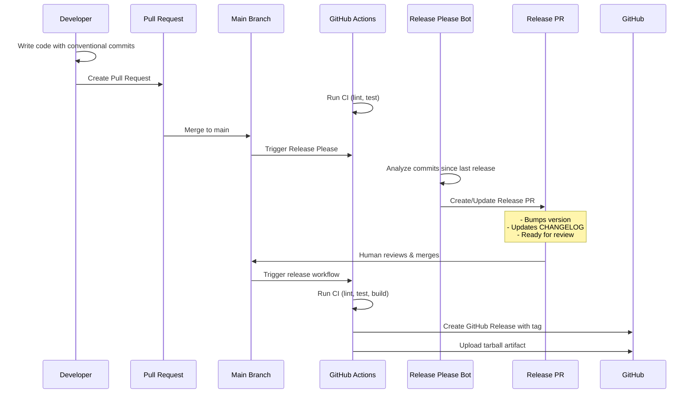

<div align="center">
  


</div>

# node-release-poc (Release Please Branch)

**Branch**: `release-please` - Demonstrates PR-based release automation using Release Please

Proof-of-concept showing **Google's Release Please approach** with:
- Bot-created release PRs for review
- Human oversight before every release
- Automated changelog generation
- GitHub-native workflow

## Table of Contents

- [Quick Start](#quick-start)
- [Release Please Process](#release-please-process)
  - [Step 1: Make code changes with Conventional Commits](#step-1-make-code-changes-with-conventional-commits)
  - [Step 2: Create and merge PR](#step-2-create-and-merge-pr)
  - [Step 3: Release Please bot creates Release PR](#step-3-release-please-bot-creates-release-pr)
  - [Step 4: Review and merge Release PR](#step-4-review-and-merge-release-pr)
- [Repository Structure](#repository-structure)
- [Docker Usage](#docker-usage)
- [Available Branches](#available-branches)
- [Branch Comparison](#branch-comparison)

## Available Branches

| Branch           | Purpose                                                     | Status       |
| ---------------- | ----------------------------------------------------------- | ------------ |
| `manual-release` | Manual release workflow with standard-version               | Active       |
| `auto-release`   | Fully automated releases via semantic-release               | Active       |
| `release-please` | **[Current]** Google's release-please automation            | Active       |
| `changesets`     | Monorepo release management with changesets                 | Experimental |

## Quick Start

1. Install dependencies:

```bash
npm ci
```

2. Install Git hooks:

```bash
npm run prepare
```

3. Run tests:

```bash
npm test
```

4. Lint code:

```bash
npm run lint
```

5. Build package tarball:

```bash
npm run build
# Creates tarball in ./dist/
```

## Release Please Process



### Step 1: Make code changes with Conventional Commits

```bash
git checkout -b feature/new-feature
git commit -m "feat: add new user endpoint"
git commit -m "fix: resolve authentication bug"
git commit -m "docs: update API documentation"
```

### Step 2: Create and merge PR

- Create a Pull Request
- CI runs (lint, test)
- Get code review
- Merge to main

### Step 3: Release Please bot creates Release PR

- After merge, Release Please analyzes commits since last release
- Automatically creates/updates a "Release PR" with:
  - Version bump in `package.json`
  - Updated `CHANGELOG.md`
  - Release notes

### Step 4: Review and merge Release PR

- Review the proposed version and changelog
- Merge the Release PR when ready
- Release workflow automatically:
  - Runs tests and builds
  - Creates GitHub Release with tag
  - Uploads tarball artifact

## Repository Structure

- `src/` - Express.js application source
- `tests/` - Jest + Supertest unit tests  
- `.github/workflows/` - GitHub Actions CI and release-please workflows
- `CHANGELOG.md` - Auto-generated by Release Please

## Docker Usage

Build image:

```bash
docker build -t node-release-poc:latest .
```

Run container:

```bash
docker run -p 3000:3000 node-release-poc:latest
```

## Branch Comparison

- **release-please** (this branch): PR-based releases via Google's Release Please
- **changesets**: Explicit changeset files with PR-based version packages
- **manual-release**: Developer-controlled releases via `npm run release`
- **auto-release**: Fully automated releases via semantic-release
