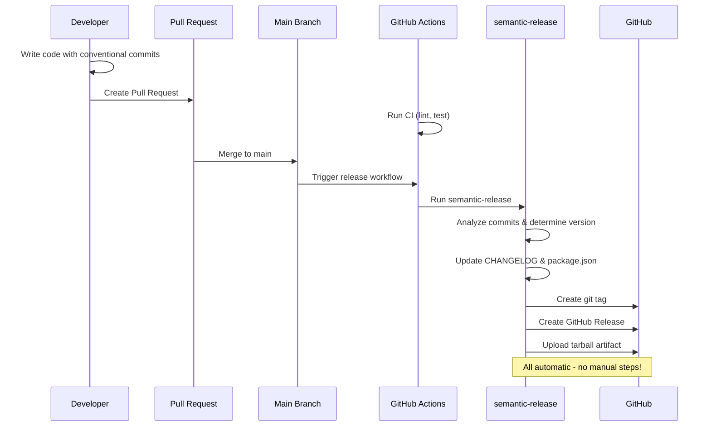

<div align="center">
  


</div>

# node-release-poc (Auto-Release Branch)

**Branch**: `auto-release` - Demonstrates fully automated release process using semantic-release

Proof-of-concept showing a **fully automated release workflow** with:

- Zero-touch releases triggered by merge to `main`
- Automatic version determination from Conventional Commits
- Automated changelog generation and GitHub Release creation
- Optional npm package publishing

## Table of Contents

- [Quick Start](#quick-start)
- [Automated Release Process](#automated-release-process)
  - [Development Workflow](#development-workflow)
  - [Commit Types & Versioning](#commit-types--versioning)
- [Repository Structure](#repository-structure)
- [Required GitHub Secrets](#required-github-secrets)
- [Docker Usage](#docker-usage)
- [Available Branches](#available-branches)
- [Branch Comparison](#branch-comparison)
- [Automated Release Benefits](#automated-release-benefits)

## Available Branches

| Branch           | Purpose                                                     | Status |
| ---------------- | ----------------------------------------------------------- | ------ |
| `manual-release` | Manual release workflow with standard-version               | Active |
| `auto-release`   | **[Current]** Fully automated releases via semantic-release | Active |
| `release-please` | Google's release-please automation                          | Active |
| `changesets`     | Monorepo release management with changesets                 | Active |

## Quick Start

1. Install dependencies:

```bash
npm ci
```

2. Install Git hooks:

```bash
npm run prepare
```

3. Run tests:

```bash
npm test
```

4. Lint code:

```bash
npm run lint
```

5. Build package tarball:

```bash
npm run build
```

## Automated Release Process



### Development Workflow

1. **Create feature branch**:

```bash
git checkout -b feature/awesome-feature
```

2. **Make changes with Conventional Commits**:

```bash
git commit -m "feat: add user authentication endpoint"
git commit -m "fix: resolve CORS configuration issue"
git commit -m "docs: update API documentation"
```

3. **Create Pull Request**:

   - CI automatically runs lint + tests
   - Code review and approval process
   - Merge when ready

4. **Automatic Release** (no manual steps!):
   - Merge to `main` triggers release workflow
   - `semantic-release` analyzes commit history
   - Automatically determines next version
   - Updates `CHANGELOG.md` and `package.json`
   - Creates git tag and GitHub Release
   - Publishes to npm (if configured)

### Commit Types & Versioning

| Commit Type                                       | Version Impact        | Example                             |
| ------------------------------------------------- | --------------------- | ----------------------------------- |
| `fix:`                                            | Patch release (1.0.1) | `fix: resolve login validation`     |
| `feat:`                                           | Minor release (1.1.0) | `feat: add password reset feature`  |
| `feat!:` or `BREAKING CHANGE:`                    | Major release (2.0.0) | `feat!: change API response format` |
| `docs:`, `style:`, `refactor:`, `test:`, `chore:` | No release            | Maintenance commits                 |

## Repository Structure

- `src/` - Express.js application source
- `tests/` - Jest + Supertest unit tests
- `.github/workflows/ci.yml` - Combined CI and automated release workflow
- `.releaserc.json` - Semantic-release configuration
- `CHANGELOG.md` - Auto-generated by semantic-release
- `RELEASE_PROCESS.md` - Detailed automated release documentation

## Required GitHub Secrets

For full automation, configure this secret in repository Settings → Secrets:

- **GITHUB_TOKEN**: Automatically available (creates releases, pushes commits)

## Docker Usage

Build image:

```bash
docker build -t node-release-poc:latest .
```

Run container:

```bash
docker run -p 3000:3000 node-release-poc:latest
```

## Branch Comparison

- **manual-release**: Developer-controlled releases via `npm run release`
- **auto-release** (this branch): Fully automated releases on merge to `main`

## Automated Release Benefits

- **Zero Human Error**: No manual version bumping or tagging
- **Fast Feedback**: Releases happen immediately after merge
- **Consistent Process**: Same release process every time
- **Audit Trail**: Complete release history in git and GitHub
- **Parallel Development**: Multiple features can be merged and released quickly

See `RELEASE_PROCESS.md` for comprehensive documentation of the 8 core release concepts and automated release configuration.
