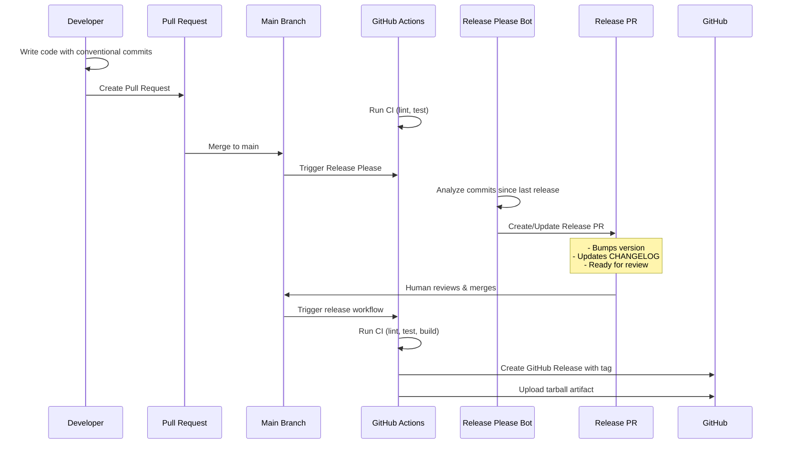

# node-release-poc (Release Please Branch)

**Branch**: `release-please` - Demonstrates PR-based release automation using Release Please

Proof-of-concept showing **Google's Release Please approach** with:
- Bot-created release PRs for review
- Human oversight before every release
- Automated changelog generation
- GitHub-native workflow

## Quick Start

1. Install dependencies:

```bash
npm ci
```

2. Install Git hooks:

```bash
npm run prepare
```

3. Run tests:

```bash
npm test
```

4. Lint code:

```bash
npm run lint
```

5. Build package tarball:

```bash
npm run build
# Creates tarball in ./dist/
```

## Manual Release Process



### Step 1: Make changes with Conventional Commits
```bash
git commit -m "feat: add new user endpoint"
git commit -m "fix: resolve authentication bug"
git commit -m "docs: update API documentation"
```

### Step 2: Create release locally
```bash
npm run release
# This will:
# - Analyze commit history
# - Bump version in package.json
# - Update CHANGELOG.md
# - Create git tag (e.g., v1.2.0)
# - Commit changes locally
```

### Step 3: Push release to trigger CI
```bash
git push origin main --follow-tags
# Pushes both commits and tags
# Tag push triggers GitHub Actions release workflow
```

### Step 4: Monitor GitHub Actions
- Check the Actions tab in your GitHub repository
- Release workflow will run tests, build package, and create GitHub Release

## Repository Structure

- `src/` - Express.js application source
- `tests/` - Jest + Supertest unit tests  
- `.github/workflows/` - GitHub Actions CI and release workflows
- `CHANGELOG.md` - Auto-generated by standard-version
- `RELEASE_PROCESS.md` - Detailed manual release documentation

## Docker Usage

Build image:
```bash
docker build -t node-release-poc:latest .
```

Run container:
```bash
docker run -p 3000:3000 node-release-poc:latest
```

## Branch Comparison

- **manual-release** (this branch): Developer-controlled releases via `npm run release`
- **auto-release**: Fully automated releases via semantic-release on merge to main

See `RELEASE_PROCESS.md` for comprehensive documentation of the 8 core release concepts and step-by-step manual release instructions.
